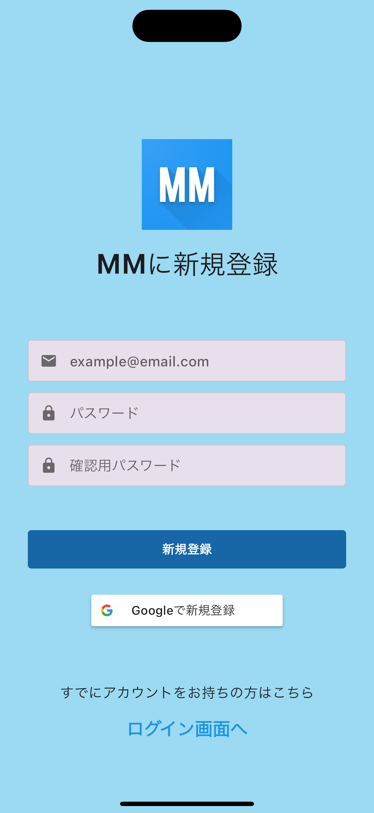
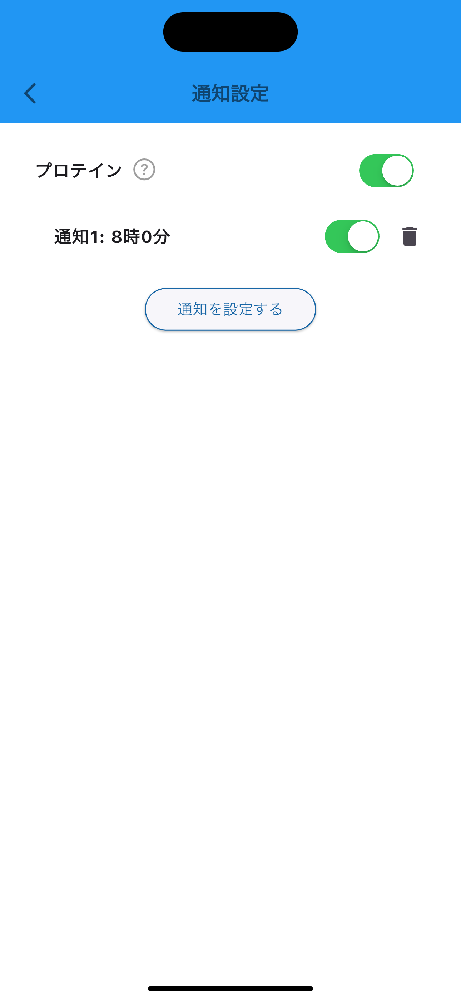

# Muscle Manager
<br>

## アプリについて
<br>

### Muscle Managerは、筋トレを効率化するいくつかの機能が入った筋トレ管理アプリです

<div style="float: right; margin: 0 10px 10px 5px;">
  
</div>

自分は日々筋トレに励んでいる中で、ふとさまざまなアプリを行き来していることに気がつきました。
<br>
そこで、筋トレ中に自分がよく使っているアプリの主な機能を１つのアプリにまとめることで、
アプリを行き来する手間をなくすことができ、より効率的に筋トレを行うことができるのではないかと思いこのアプリを作りました。
<br>

筋トレを続けたいけど、いつも思いつきで筋トレを始めてやめての繰り返しをしていて、なかなか継続できない…
そんな人をこのアプリを通して少しでもサポートできればなと思います！

<br>
<br>
<br>
<br>
<br>

***
## イメージ画像
  

<br>

   

<br>

  

<br>

  

<br>

  

<br>

   

<br>
<br>
<br>
<br>
<br>

***
## 使い方

### 1. Flutterの環境構築
↓↓こちらの記事を参考にしてください<br>
  [Flutter環境構築](https://zenn.dev/kazutxt/books/flutter_practice_introduction/viewer/06_chapter1_environment)

### 2. リポジトリのclone
```
git clone https://github.com/kiichi7580/Muscle_training_app.git
```

### 3. シュミレーターの起動
```
open -a Simulator
```

### 4. 「Muscle Manager」アプリを選択
「Muscle Manager」のアイコンをタップしてアプリをご利用ください

<br>
<br>
<br>
<br>
<br>

***
## 主な機能

- ### 🗓️ カレンダー機能

  - #### 予定を記入し、スケジュール管理ができる

  - #### ( 提供する価値 ) → 過去のスケジュールを見ることで、自分がどれくらいの期間・間隔で筋トレを継続できているのかがわかる

  <br>
  <br>

- ### 📝 メモ機能

  - #### 種目、重量、セット数、回数を記入し、今日のメニューを振り返ることができる

  - #### ( 提供する価値 ) → 過去の記録を見ることで、自分の努力量や成長率を知ることができ、モチベーション☝️☝️につながる

  <br>
  <br>

- ### ⏰ タイマー機能

  - #### タイマー時間を自由に設定できる
  - #### ( 提供する価値 ) → 筋トレ時間・休憩時間をタイマーで区切ることで、ダラダラ時間をなくし集中して筋トレをすることができる

<br>
<br>

- ### 👥 SNS機能

  - #### 他ユーザーと繋がり、他ユーザーの筋トレ頻度を閲覧できる

  - #### ( 提供する価値 ) → 他ユーザーの筋トレ頻度を閲覧したり、自分の筋トレ頻度が他ユーザーから見られるという意識から、筋トレのモチベーションに繋げる

<br>
<br>

- ### 📣 通知機能

  - #### プロテインを飲みたい時間に通知が送られる

  - #### ( 提供する価値 ) → プロテインの飲み忘れを防ぎ、自分が1日に取りたいタンパク質量を摂取することができる

<br>
<br>
<br>
<br>
<br>

***
## 画面遷移図

<br>


<br>
<br>

***
## こだわったところ

- ### 🗓️ カレンダー画面

  - #### 予定リストをカレンダーの下側に表示して、その日の予定を確認できるようにした
  - #### 筋トレした日は、その日の記録が見れるようにボトムシートでメニューが表示されるようにした

<br>
<br>

- ### 📝 メモ画面

  - #### メモを記入するときに、種目、重量、セット数、回数と細かい記録を記入できるように入力欄を作成した

  - #### いつものメニューをテンプレート化し、一括でメモに追加できるようにした
<br>
<br>

- ### ⏰ タイマー画面

  - #### タイマーの進捗状況がわかるようにタイマー表示画面に円形のプログレスバーを表示させた

  - #### 画面を見なくてもわかるように、タイマーの開始と終了を合図する音声をつけた

<br>
<br>

- ### 👤 プロフィール画面

  - #### 短期目標と長期目標を設定することで、自分の筋トレの目的を再認識させる仕組みにした

  - #### 自分の筋トレ頻度を可視化するウィジェットを作成し、他ユーザーからも閲覧できるようにした

<br>
<br>

- ### 全体的に

  - #### シンプルなデザインにして、直感的に使えるUIを心がけた

  - #### リスト化や表形式にして、ユーザー情報を提供するようにした

<br>
<br>
<br>
<br>
<br>

***
## 追加したい機能

<br>

- #### 筋トレのフィードバックを記録できる機能

- #### 動画や4コマ漫画で筋トレのやり方をわかりやすく説明する

- #### 他ユーザーに自分のメニューを共有できる機能

- #### RM換算表

- #### このアプリのチュートリアル

<br>
<br>
<br>
<br>
<br>

***
## 使ったパッケージ

<br>

- ### UI関連
  - carousel_slider:
  - circular_countdown_timer:
  - flutter_colorpicker:
  - flutter_datetime_picker_plus:
  - flutter_launcher_icons:
  - flutter_native_splash:
  - flutter_picker:
  - flutter_slidable:
  - flutter_speed_dial:
  - flutter_svg:
  - modal_bottom_sheet:
  - sign_in_button:
  - syncfusion_flutter_datagrid: 
  - table_calendar:
 
<br>

- ### 状態管理

  - flutter_riverpod:
  - provider:

<br>

- ### ビルド関連

  - build_runner:
  - json_serializable:

<br>

- ### データ保存関連

  #### クラウド
  - firebase_core:
  - firebase_storage:

  #### ローカル
  - shared_preferences:
<br>


- ### データ処理関連

  - flutter_localization:
  - flutter_localizations:
  - flutter_native_timezone:
  - freezed:
  - freezed_annotation:
  - image_picker:
  - intl:
  - json_annotation:
  - riverpod_annotation:
  - timezone:
  - uuid:

<br>

- ### 認証関連

  - firebase_auth:
  - google_sign_in:

<br>

- ### 音声

  - audioplayers:

<br>

- ### 通知

  - permission_handler:
  - flutter_local_notifications:

<br>

- ### コード改善

  - import_sorter:

<br>


