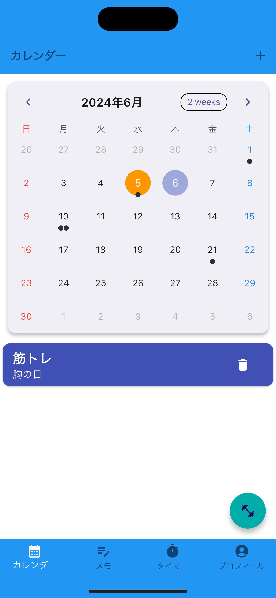
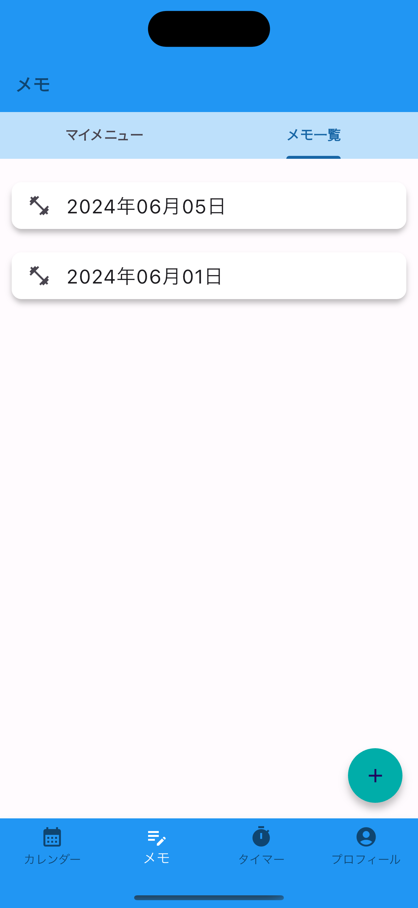
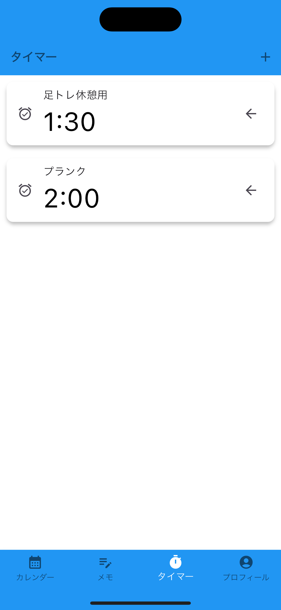

# Muscle Manager
<br>

## アプリについて
<br>

### Muscle Managerは、筋トレを効率化するいくつかの機能が入った筋トレ管理アプリです

<div style="float: right; margin: 0 10px 10px 5px;">
  
</div>

自分は日々筋トレに励んでいる中で、ふとさまざまなアプリを行き来していることに気がつきました。
<br>
そこで、筋トレ中に自分がよく使っているアプリの主な機能を１つのアプリにまとめることで、
アプリを行き来する手間をなくすことができ、より効率的に筋トレを行うことができるのではないかと思いこのアプリを作りました。
<br>

筋トレを続けたいけど、いつも思いつきで筋トレを始めてやめての繰り返しをしていて、なかなか継続できない…
そんな人をこのアプリを通して少しでもサポートできればなと思います！

<br>
<br>
<br>
<br>
<br>

***
## イメージ画像
  

<br>

   

<br>

    

<br>

   

<br>

 


<br>
<br>
<br>
<br>
<br>

***
## 使い方

### 1. Flutterの環境構築
↓↓こちらの記事を参考にしてください<br>
  [Flutter環境構築](https://zenn.dev/kazutxt/books/flutter_practice_introduction/viewer/06_chapter1_environment)

### 2. リポジトリのclone
```
git clone https://github.com/kiichi7580/Muscle_training_app.git
```

### 3. シュミレーターの起動
```
open -a Simulator
```

### 4. 「Muscle Manager」アプリを選択
「Muscle Manager」のアイコンをタップしてアプリをご利用ください

<br>
<br>
<br>
<br>
<br>

***
## 主な機能

- ### 🗓️ カレンダー機能

  - #### 予定を記入し、スケジュール管理ができる
  - #### ( 提供する価値 ) → 過去のスケジュールを見ることで、自分がどれくらいの期間・間隔で筋トレを継続できているのかがわかる

  <br>
  <br>

- ### 📝 メモ機能

  - #### 種目、重量、セット数、回数を記入し、今日のメニューを振り返ることができる
  - #### ( 提供する価値 ) → 過去の記録を見ることで、自分の努力量や成長率を知ることができ、モチベーション☝️☝️につながる

  <br>
  <br>

- ### ⏰ タイマー機能

  - #### タイマー時間を自由に設定できる
  - #### ( 提供する価値 ) → 筋トレ時間・休憩時間をタイマーで区切ることで、ダラダラ時間をなくし集中して筋トレをすることができる

<br>
<br>
<br>
<br>
<br>

***
## 画面遷移図

<br>


<br>
<br>

***
## こだわったところ

- ### 🗓️ カレンダー画面

  - #### 予定リストをカレンダーの下側に表示して、その日の予定を確認できるようにした
  - #### 筋トレした日は、その日の記録が見れるようにボトムシートでメニューが表示されるようにした

<br>
<br>

- ### 📝 メモ画面

  - #### メモを記入するときに、種目、重量、セット数、回数と細かい記録を記入できるように入力欄を作成した

<br>
<br>

- ### ⏰ タイマー画面

  - #### タイマーの進捗状況がわかるようにタイマー表示画面に円形のプログレスバーを表示させた

<br>
<br>

- ### シンプルなデザイン

  - #### 全体的に青単色にして、初めてでも使いやすいシンプルなデザインを意識して作成した
  - #### 全体的にリスト化して、みやすいUIを心がけた

<br>
<br>
<br>
<br>
<br>

***
## 追加予定の機能

- ### 🗓️ カレンダー画面
  - #### 筋トレした日は、その日の記録が見れるようにメニュー表示画面へ遷移させたり、もしくはダイアログ、ボトムシートなどでメニューが表示されるようにしたい(追加済み)

  - #### 予定リストの一つ一つに色をつけられる機能(追加済み)
<br>
<br>

- ### 📝 メモ画面

  - #### メニュー表示画面のデザインがシンプルすぎるので、もう少し見やすいように表形式にしたい<br>例）Data-Table（パッケージ）を使用するなど

  - #### トグルボタンを使用して、自重トレーニングとウエイトトレーニングでメモの仕方を分けられるようにする

<br>
<br>

- ### ⏰ タイマー画面

  - #### タイマーの用途を明確にするために、タイマーに名前をつけられるようにしたい（追加済み）

  - #### 0秒になったら音が鳴るようにしたい

<br>
<br>

- ### その他

  - #### 筋トレ始めてたの人をサポートするチュートリアル画面を作りたい
  - #### １日で摂取したい栄養素(タンパク質量など)を記録できる機能

<br>
<br>
<br>
<br>
<br>

***
## 使ったパッケージ

- ### カレンダー機能

  - #### table_calendar:
  - #### flutter_colorpicker:
 

<br>

- ### タイマー機能

  - ##### circular_countdown_timer:

<br>

- ### 状態管理

  - #### provider:
  - #### flutter_riverpod:

<br>

- ### データ処理関連

  - #### intl:
  - #### flutter_localization:
  - #### flutter_localizations:

<br>

- ### Firebase関連

  - #### firebase_core:
  - #### cloud_firestore:
  - #### firebase_auth:

<br>

- ### UI関連

  - #### flutter_native_splash:
  - #### flutter_launcher_icons:
  - #### flutter_slidable:
#
<br>


